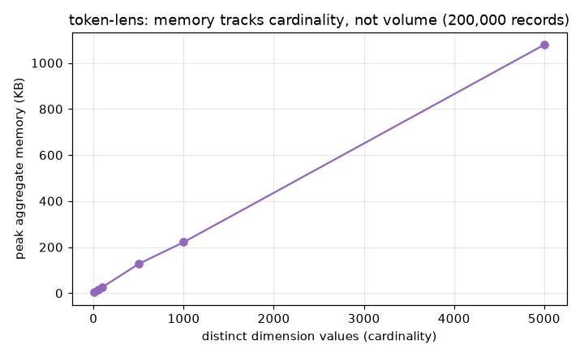
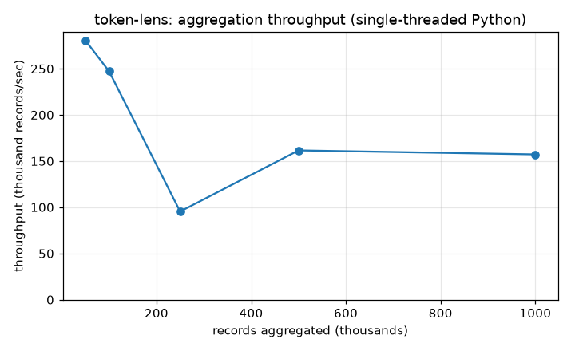

# Benchmarks

Produced by `bench/benchmark.py` (needs `matplotlib`; the library and its tests have
no third-party dependencies):

```
python bench/benchmark.py
```

It writes the two graphs below and `bench/results/summary.json`. These measure the
Python reference implementation; the C# and Java ports share the algorithm and are
faster. Absolute timing depends on the machine; the memory result is architectural
and reproduces anywhere.

## Memory tracks cardinality, not volume



Peak aggregate memory for a **fixed 200,000 records**, as the number of distinct
dimension values changes:

| Distinct values | Peak memory |
|:---------------:|:-----------:|
| 10 | 3.1 KB |
| 50 | 13.5 KB |
| 100 | 26.5 KB |
| 500 | 126.6 KB |
| 1,000 | 221.4 KB |
| 5,000 | 1,078.6 KB |

This is the load-bearing result. The record count is held constant at 200k the whole
time - only the cardinality changes - and memory scales with cardinality, not with
the 200k records. Ten features cost 3 KB; five thousand cost ~1 MB. That's because
aggregation folds records into one bucket per distinct value and never retains the
records themselves. Point it at a firehose grouped by feature or tenant and its
memory stays small and predictable; the only thing that grows it is how many distinct
groups you ask for.

## Aggregation throughput



Single-threaded, pure Python, cardinality 50:

| Records | Throughput |
|:-------:|:----------:|
| 50,000 | ~280k/sec |
| 100,000 | ~250k/sec |
| 250,000 | ~160-240k/sec |
| 500,000 | ~160k/sec |
| 1,000,000 | ~155k/sec |

Aggregation does O(1) work per record - a dict lookup and a few additions - so the
total work is linear. Throughput still eases off at very high volume (from ~280k to
~155k records/sec): that's the working set of a million record objects outgrowing CPU
cache, not an algorithmic problem. In other words, the per-record *instruction* count
is constant; the per-record *time* creeps up because memory gets further away. The
compiled C#/Java ports, with tighter value types and better cache behavior, don't pay
as much of that tax. I'm reporting the honest measured curve rather than cherry-
picking the small-input number.

## Reading these together

Memory is the property that decides whether a cost tool survives production traffic,
and it's the clean one here: bounded by how many groups you attribute to, independent
of how many records flow through. Throughput is comfortably in the hundreds of
thousands per second - fast enough to summarize a real usage window in well under a
second - with an honest note about cache effects at the extreme end.
