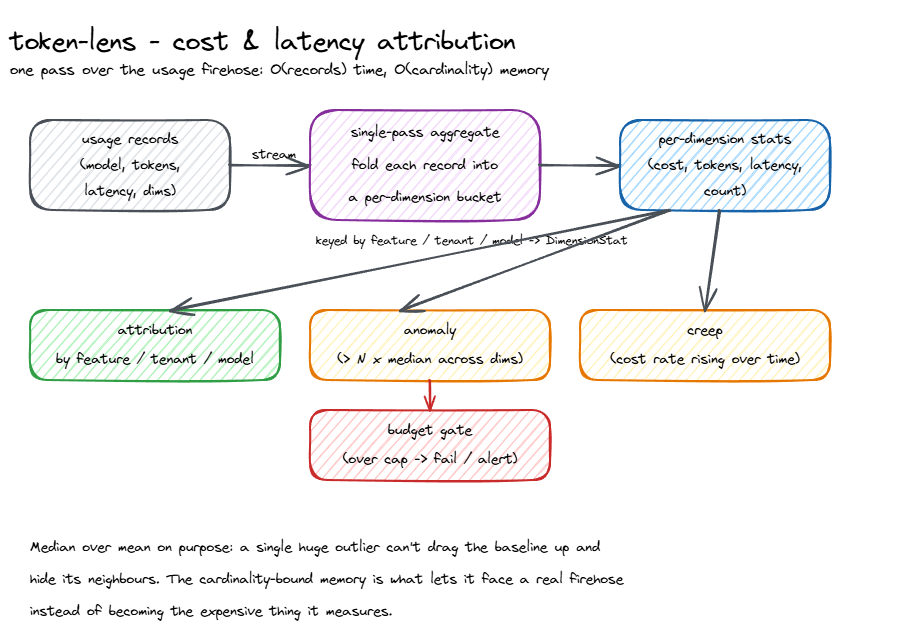

# token-lens: design, trade-offs, and non-goals

Status: accepted
Author: Parag Sawant

Why token-lens is shaped the way it is. It answers a question every team running
LLMs eventually asks - "what did all this cost, and where did it go?" - and the only
way that answer is useful is if the tool can chew through a real volume of usage
records without becoming the expensive thing itself.

## Problem and goals

You have a stream of usage records (model, tokens, latency, and which
feature/tenant/user produced them). You want cost and latency attributed by any of
those dimensions, a budget gate, and a heads-up when something is abnormal. Goals:

1. Attribute cost/latency by feature, tenant, or model.
2. Flag anomalies (a dimension far above its peers) and creep (a dimension whose
   cost rate is rising over time).
3. Scale: process a large batch of records with memory that depends on how many
   distinct dimension values there are, not on the record count.
4. The same behavior in Python, C#, and Java.

*(Source: [`docs/diagrams/attribution-flow.excalidraw`](docs/diagrams/attribution-flow.excalidraw) - editable in [excalidraw](https://aka.ms/excalidraw).)*

## Key design decisions

**Single-pass aggregation into per-dimension buckets.** `aggregate` walks the
records once and folds each into a `DimensionStat` keyed by its dimension value.
That makes the work O(records) and the memory O(cardinality) - a million records
over ten features cost the same memory as a thousand records over ten features.
This is the property that lets it face a firehose; the benchmark measures it
directly.

**Median-based anomaly detection.** A dimension is anomalous if its cost is more
than N x the median across dimensions. I chose the median over the mean deliberately:
the mean is dragged around by the very outliers we're trying to detect, so a single
whale would hide itself. The median is robust to that.

**Rolling-window creep detection that bins by timestamp.** Anomaly detection catches
something expensive *right now*; creep catches something getting more expensive
*over time*. It splits records into an earlier baseline window and a recent window,
compares cost *rate* (cost per unit time, so uneven windows compare fairly), and
flags a dimension whose recent rate exceeds `factor x` its baseline. Because it bins
by timestamp rather than by arrival order, it's correct even when records arrive out
of order - which the stress suite asserts by shuffling the input and checking the
result is identical.

**Pricing as versioned, effective-dated config.** There's no live price feed for
tokens; list prices change a few times a year. So pricing lives behind a small
provider interface (static default, versioned file, chained fallback), and a usage
record can be rated at the price in effect at *its* timestamp. That's config, not
logic, and it's kept separate so the aggregation core doesn't care where prices come
from.

## Trade-offs I made on purpose

- **Batch, not streaming.** `aggregate` takes a list and returns a report; it isn't
  an online accumulator you feed one record at a time forever. For the "summarize a
  window of usage" job that's simpler and faster. A true streaming accumulator that
  holds only the running `DimensionStat`s (and never the records) is the natural
  extension, and the data model already supports it.
- **Cardinality, not volume, bounds memory - but cardinality is unbounded.** If your
  dimension is something with millions of distinct values (a per-request id), the
  bucket count grows with it. That's inherent to group-by; pick a dimension with
  sane cardinality (feature, tenant, model), which is what the API nudges you toward.
- **Creep uses a simple two-window split.** A full rolling regression would detect
  subtler trends; the two-window rate comparison is easy to reason about and catches
  the case that matters (steady upward drift). Noted as future work.

## Non-goals

- **Not a metrics backend.** It doesn't store time series, render dashboards, or page
  anyone. It computes a report; where that goes is your call.
- **Not a billing system of record.** Costs are illustrative list prices unless you
  wire your own; use it to *attribute and alert*, not to invoice.
- **No sampling or cardinality control built in.** If you point it at an
  unbounded-cardinality dimension, that's on the caller.

## Benchmarks

See `BENCHMARKS.md`. Short version: aggregation runs at ~125k-325k records/sec
single-threaded in pure Python (the compiled ports are faster), and peak memory
tracks dimension cardinality - flat as record volume grows, rising only as the
number of distinct values does. That's the scaling property that makes it usable on
a real usage stream.
